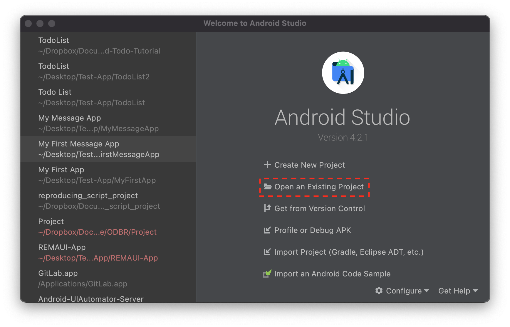

# Android-Todo-Tutorial

This repository holds the code for the Android ToDo List tutorial. 

## How to use

To use this repoistory, you can simply clone the project using `git` or download the zip file using the button at the top of the page. Then you can import the project into Android studio by using the "Open Existing Project" Button, and selecting the root of the directory.

## Browsing the Code

You can also browse the code in your web browsers by navigating through the directory hierarchy above.
